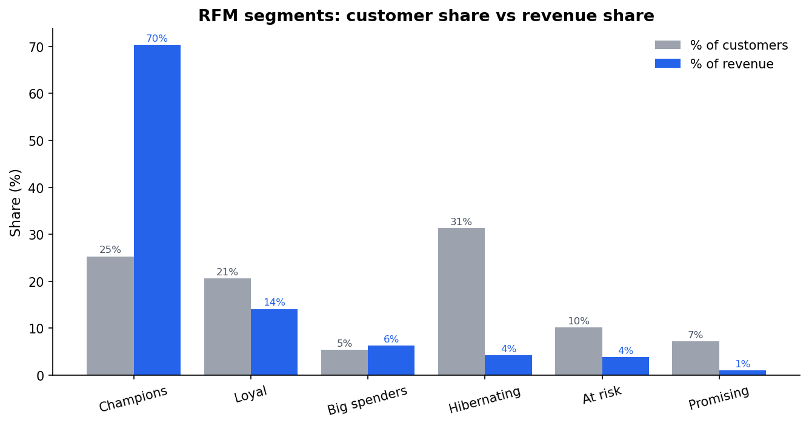
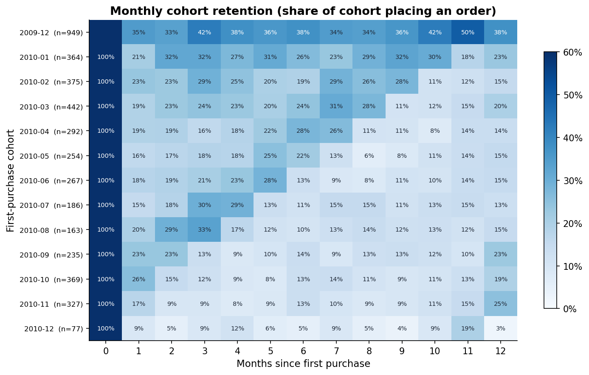
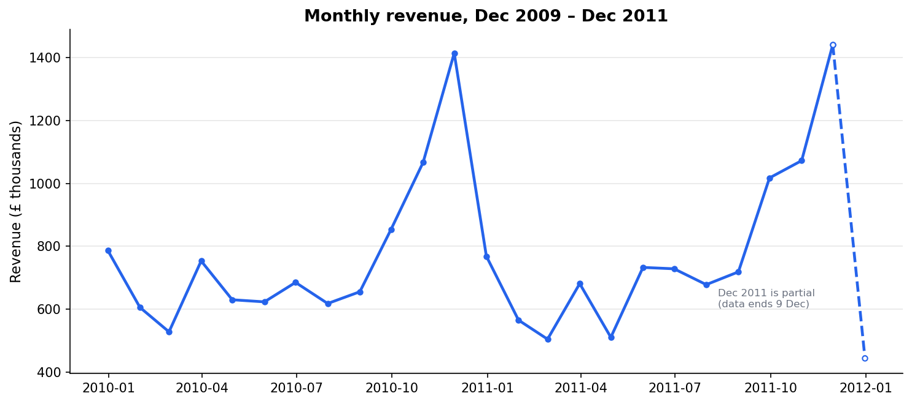
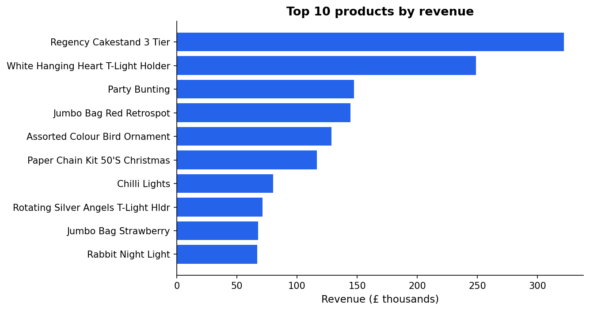
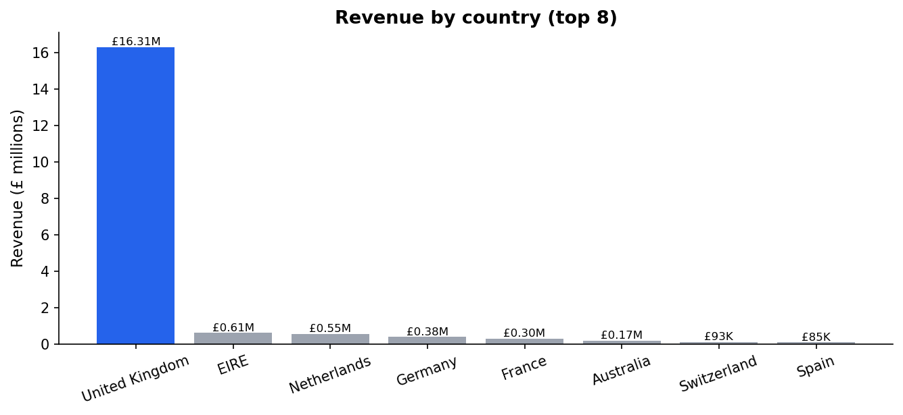

# E-commerce Customer Retention & Revenue Analysis

End-to-end analysis of **1.07M real transactions** (Dec 2009 – Dec 2011) from a UK-based
online giftware retailer, answering one business question: **where does revenue actually
come from, and which customers deserve marketing spend?**

**Tools:** Python (pandas, matplotlib) · SQL (DuckDB) · Jupyter

| | |
|---|---|
| 📓 Full analysis | [`notebooks/retention_analysis.ipynb`](notebooks/retention_analysis.ipynb) |
| 🗃️ Same analysis in pure SQL | [`sql/analysis_queries.sql`](sql/analysis_queries.sql) |
| 🧹 Cleaning pipeline | [`src/prepare_data.py`](src/prepare_data.py) |

---

## Key findings

**1. Repeat buyers are the whole business.** 72% of identified customers order more than
once, and repeat buyers drive **96.7% of customer revenue** (£19.1M total revenue,
39,231 orders, average order value £487). Retention, not acquisition, is the lever.

**2. A quarter of customers generate 70% of revenue.** RFM segmentation (quintile scores
on Recency / Frequency / Monetary value) shows the "Champions" segment — 25% of
customers, ~15 orders each — accounts for **£11.6M of £16.5M identified-customer
revenue**. Meanwhile ~600 formerly frequent "At risk" customers (£640K of historical
revenue) haven't ordered in over a year.



**3. Month 1 is where customers are won or lost.** Only **~21% of new customers return
in their first month** — but the cohorts that survive stabilise at 20–25%+ retention for
up to two years instead of decaying to zero. The first repeat purchase is the critical
conversion event.



**4. The business is heavily seasonal and UK-concentrated.** November revenue peaks at
~£1.4M — 2.5–3x the spring trough — driven by wholesale Christmas stocking. The UK is
85.5% of revenue; EIRE, the Netherlands, Germany and France already buy at volume with
no localised marketing.







## Recommendations

1. **Launch a first-30-days onboarding flow** (post-purchase email sequence + repeat
   incentive). A 3-point lift in month-1 retention compounds across every future cohort.
2. **Protect Champions** with loyalty perks and stock priority — cheap insurance on £11.6M.
3. **Win back the At-risk segment** (~600 high-frequency lapsed customers) before they churn fully.
4. **Anchor inventory planning on the Q4 ramp**; top SKUs are seasonal gift/decor items.
5. **Test localised international marketing** in the four non-UK countries already buying at volume.

## Data cleaning (the unglamorous part that changed the answers)

Raw file: 1,067,371 rows. Issues found and handled in [`src/prepare_data.py`](src/prepare_data.py):

| Issue | Rows | Treatment |
|---|---:|---|
| Exact duplicate rows | 34,335 | Dropped |
| Cancelled orders | 25,167 | **Matched each cancellation to its original purchase row (same customer, product, price, quantity) and removed both.** Without this, the famous 80,995-unit "PAPER CRAFT, LITTLE BIRDIE" order — reversed minutes after entry — inflates revenue by £168K and tops the product ranking. |
| Non-positive quantity/price | 6,019 | Dropped (damaged stock write-offs, data errors) |
| Non-product rows | 4,403 | Dropped (postage, manual adjustments, bank charges) |
| Missing customer ID | ~23% of rows | Kept in revenue totals; excluded from customer-level analyses (cohorts, RFM) |

Final analysis table: **996,733 rows · 39,231 invoices · 5,835 identified customers**.

## Reproduce it

```bash
pip install -r requirements.txt

# 1. Download the dataset (44MB) into data/raw/
curl -L -o data/raw/online_retail_ii.zip \
  "https://archive.ics.uci.edu/static/public/502/online+retail+ii.zip"
unzip -d data/raw data/raw/online_retail_ii.zip

# 2. Clean -> data/processed/transactions_clean.parquet
python src/prepare_data.py

# 3. Charts + KPI summaries -> charts/, data/processed/
python src/analysis.py

# 4. (Optional) run the SQL version against the same parquet
duckdb -c ".read sql/analysis_queries.sql"
```

**Data source:** Chen, D. (2019). [Online Retail II](https://archive.ics.uci.edu/dataset/502/online+retail+ii).
UCI Machine Learning Repository.
